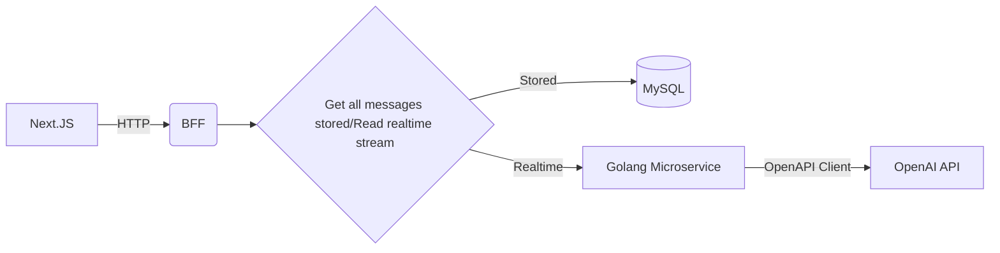

# ChatGPT Clone integration project

## Technologies used
1. Golang
2. Next.JS
3. OpenAI API
4. Prisma
5. SQLC
6. gRPC

## Getting started with protobuf

Protobuf configuration: https://grpc.io/docs/languages/go/quickstart/

# System Architecture

This is a simple system architecture for a frontend web application that communicates with BFF (backend for frontend) and this backend communicates with a microservice and the OpenAI API.

## Architecture Diagram

